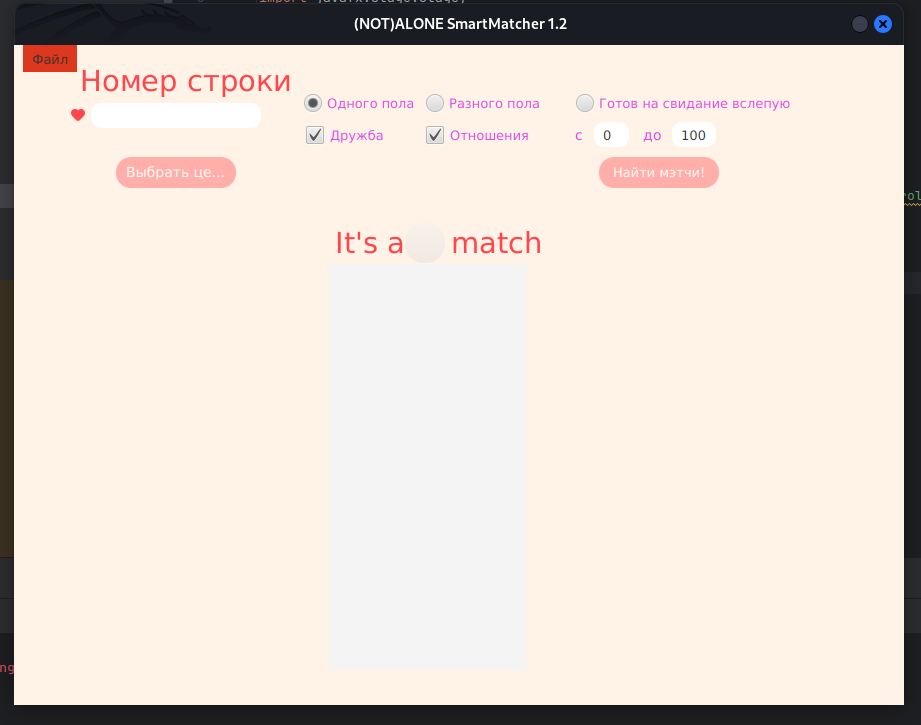

## Not Alone Algorhythm
Back in a day, me and my friends held a university event dedicated to St.Valentines Day. The idea was to initially host a questionnaire in Google Forms, then export the results and use it as a database to help participants find their perfect match.
The algorhythm itself is highly coupled to a specific questionnaire structure. The core of an algo uses relative rating technique to find best match for a certain person.
I don't think it'll be needed whenever, but I'll just keep it as a warm memory for myself.

